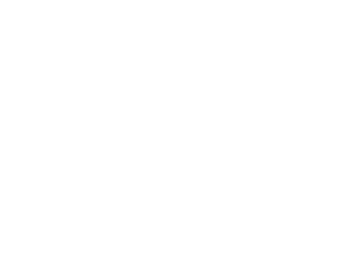

# React Trading App
## Introduction
The Trading App is a modern web-based application designed to help users view and manage a stock traders' accounts,
and to view real-time market quotes. The applications provides an interface where users can add, remove, and view trader profiles, as well as fetch live stock quote information use Alpha Vantage's stock API.
The app is intended for internal trading teams, or users interested in managing a portfolio of traders while monitoring live market data.

The project follows a component-based architecture using **ReactJS** for the front end, and **Ant Design (antd)** for its UI components. It utilized **npm** for package management and React Router for page navigation. The application is modular and easy to extend for expanded features such as quote customization and purchase handling.

## Quick Start

1. Install Node.js and npm (skip this step if they are already installed)
2. Clone repository (one cloned, open the folder)
```
git clone https://github.com/jarviscanada/jarvis_data_eng_CurtisLopes/tree/develop/frontend/trading-ui
```
3. Install dependencies
```
npm install
```
4. Start application
```
npm start
```
5. Application will open in browser, address http://localhost:3000

## Implementation
The Trading App is built using functional React component and hooks such as **useState** and **useEffect**, and the UI is prowered by **antd** components for consistency and responsiveness. The core features of the app are divided across components:
- **NavBar**: Displays the the page's navigation links.
- **Dashboard**: Displays the trader list and allows users to add traders via a modal form, or delete traders from the list.
- **QuotePage**: Fetches and displays stock quotes retrieved from Alpha Vantage's Time Series Daily API using Axios.
- **TraderList**: Renders the list of traders with support for deletion.
## Architecture

## Test
The application has been tested manually via browser navigation through the UI, verifying form validation, trader list rendering, quote fetching and modal interaction.
## Deployment
The application was version controlled and deployed using GitHub.
## Improvements
1. Add functionality for adding and removing stock ticker symbols dynamically on the Quotes Page.
2. Implement 'Trade History' page for each trader.
3. Implement 'Account' page for each trader that displays funds available to each trader.
