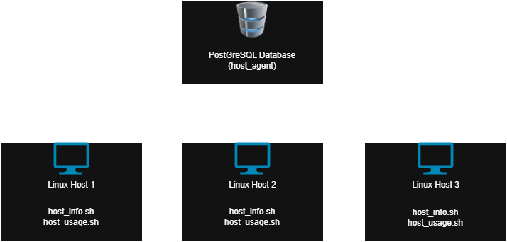

# Linux Cluster Monitoring Agent
# Introduction
This project implements a lightweight Linux monitoring agent that
collects hardware specifications and resource usage data from 
a host machine and stores it in a centralized PostgreSQL database.
The goal is to enable efficient infrastructure monitoring, providing visibility
into CPU, memory, and disk activity.

The primary users of this tool are system administrators and DevOps
engineers who need a way to collect and analyze a host's data.

The monitoring agent uses Bash scripts and tools such as
`docker`, `psql`, and `crontab`. The project emphasizes modular scripting, automated scheduling,
and proper database design to handle dynamic data collection.
# Quick Start
```bash
# Start a PostgreSQL container
./scripts/psql_docker.sh start [db_username] [db_password]

# Create the necessary tables
psql -h localhost -U [db_username] -d host_agent -f ./sql/ddl.sql

# Collect and insert hardware specs (run once)
./scripts/host_info.sh localhost 5432 host_agent [db_username] [db_password]

# Collect and insert usage data (run every minute)
./scripts/host_usage.sh localhost 5432 host_agent [db_username] [db_password]

# Setup crontab (adds host_usage.sh to run every minute)
crontab -e
# Add the following line:
* * * * * bash ~/path/to/scripts/host_usage.sh localhost 5432 host_agent [db_username] [db_password]
```
# Implementation
## Architecture

The system follows a client-server architecture where multiple Linux machines (hosts) act as
data collection agents. Each host runs two Bash scripts: `host_info.sh` (executed once) and `host_usage.sh` (executed every minute via `crontab`).
These scripts collect hardware specifications and real-time resource usage data, then send it 
to a central PostgreSQL database hosted in a `docker` container. This setup allows for centralized
monitoring of systems, making it scalable, portable, and easy to deploy.
## Scripts
- `host_info.sh` is run once by each host in the cluster to gather hardware configuration information about the host
- `host_usage.sh` is run once every minute by the hosts in the cluster to collect up-to-date information
about a given host's usage
- `ddl.sql` is an SQL file that creates the database and tables in which the data will be stored
- `psql_docker.sh` is a script to start, stop, or create a PostGreSQL `docker` container to store the data collected from the hosts in the cluster
## Database Modeling
The database, `host_data`, consists of two tables; `host_info` and `host_usage`. For each host, `host_info` stores static
hardware specifications, while `host_usage` stores dynamic performance metrics.

`host_info` stores the following information, all of which is assumed to stay constant:
- `id`: The unique id number which corresponds to a host. Serves as a primary key in 
the table and is auto-incremented by PostgreSQL
- `hostname`: Domain name of the host
- `cpu_number`: Number of CPUs
- `cpu_architecture`: CPU architecture
- `cpu_model`: CPU model name
- `cpu_mhz`: CPU clock speed in MHz
- `l2_cache`: Size of l2 cache in kB
- `timestamp`: Time of data collection
- `total_mem`: Total memory in kB

`host_usage` stores the following information, with information being added every minute by each host
in order to keep resource usage information up-to-date and to track usage over time:
- `timestamp`: Time of data collection
- `host_id`: id associated with a host in the `host_info` table in the database
- `memory_free`: Free memory available in MB
- `cpu_idle`: Percentage of idle CPU
- `cpu_kernel`: Percentage of CPU time spent in kernel mode
- `disk_io`: Dick I/O activity (number of write operations)
- `disk_available`: Available disk space in MB
# Test
The scripts were tested in a local `docker` container environment. `host_info.sh` was run once to insert hardware data
and verified using SQL queries on the `host_info` table in the `host_agent` database. Once confirmed to be running correctly,
`host_usage.sh` was tested using `crontab` to ensure new usage data is appended every minute.
We verified usage data by running SQL queries on the `host_usage` table in the `host_agent` database.
# Deployment
The monitoring agent is deployed using `Github`, `docker`, and `crontab`. All Bash scripts,
DDL, and supporting documentation are version-controlled using `Github` for reproducibility.
The `host_usage.sh` script is scheduled using `crontab` to run every minute on the Linux host, providing
continuous data collection without manual intervention.
A PostGreSQL database is deployed using a `docker` container to simulate a real-world server
environment.
# Improvements
1. Handle Hardware Updates: Add logic to update `host_info` if hardware changes (e.g. CPU upgrade).
2. Notification System: Enhance the system by adding a feature that notifies the user when
CPU usage, memory, or disk usage crosses certain thresholds.
3. Web UI for Data Visualization: Add a web dashboard that automatically updates based on the
collected usage data.


