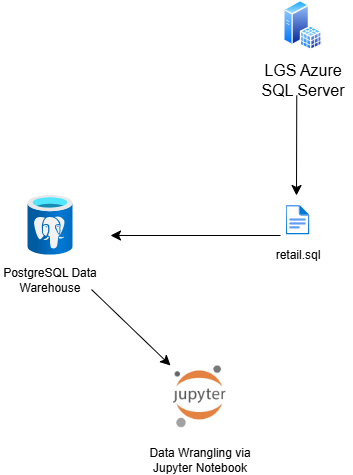

# Python Data Analytics - LGS
## Introduction
London Gift Shop (LGS) is a UK-based online retailer seeking to 
boost revenue by gaining a better understanding of customer behaviour.
This is a proof of concept (POC) project that analyzes historical purchase 
data to help the marketing team develop effective sales and marketing techniques to 
grow the business.

The project was completed using Python, PSQL database, docker, and Jupyter Notebook. We used 
libraries such as Pandas, Matplotlib and Seaborn to perform data analysis
and generate data visualizations. Using these tools we built an RFM (Recency, Frequency, Monetary)
model to segment customers. These insights can be used by the LGS marketing team
to create campaign strategies such as promotions for high-value customers, or reactivation
campaigns for lapsed buyers. The project was deployed using Jupyter Notebook and GitHub
to provide the LGS team with accessible analytics.

# Implementation
## Project Architecture

- Data Source: LGS IT team provided raw transaction data (2009 - 2011) exported from their
Azure SQL Server as a `.sql` file
- PostgreSQL Warehouse: Data was imported into a PostgreSQL database running in a Docker container
- Jupyter Notebook: A second Docker container runs a Jupyter Notebook used for data wrangling,
RFM segmentation, and data visualization
- Docker Network: Containers are connected via a shared Docker network for seamless SQL access
- GitHub: Jupyter Notebook has been uploaded to GitHub for the LGS Marketing team as a POC

## Data Analytics and Wrangling
[Analysis notebook](./retail_data_analytics_wrangling.ipynb)

Our data wrangling and RFM segmentation identified three key customer segments 
for targeted marketing strategies:

- Champions (852 customers): These are LGS's most valuable customers. Loyalty programs,
early access to new products, and personalized offers can help retain and reward this segment,
driving revenue growth.
- Can't Lose (71 customers): These high-value customers are at risk of churning. LGS can address this
with win-back campaigns, including tailored discounts, and recommendations based on past 
purchases to promote re-engagement.
- Hibernating (1,522 customers): These customers are inactive, but may be reactivated with broad
outreach campaigns. Limited-time offers, or bundled promotions may spark renewed interest in LGS.

# Improvements
1. Integrate with a Web App so LGS stakeholders can explore segments
2. Automate Data Pipeline so RFM scores are updated regularly
3. Integration with LGS Marketing Platform to automatically generate
personalized campaigns for customer segments when specific criteria are met