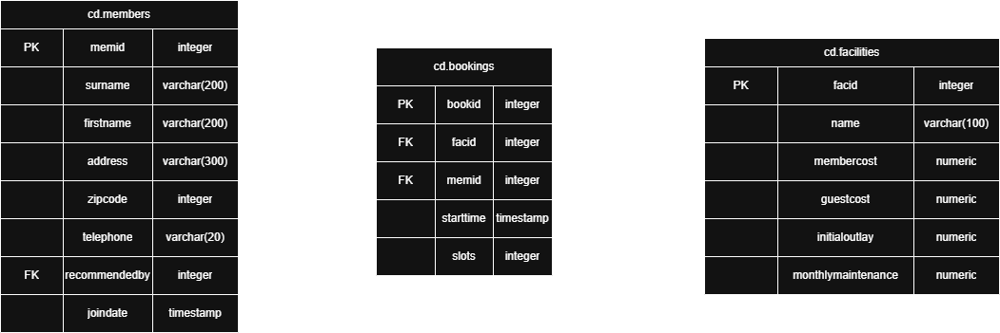

# Introduction
This project implements a relational database system for managing a sports club's facilities,
members, and bookings using PostgreSQL. The design uses structured data representation,
schema normalization, and query-based access patterns to simulate real-world club operations.
Users of this system may include club administrators, and technical teams responsible for managing
membership, facility usage, and historical data.

The database is containerized using `docker` to ensure a consistent and portable development 
environment. PostgreSQL is the primary database engine, allowing for realistic SQL
queries and DDL/DML operations. SQL scripts are used to automate database setup, while `git` was used for
version control throughout the development process.

The project emphasizes schema design, SQL proficiency, and working with containerized databases in a 
Linux environment. SQL scripts (`.sql` files) are used to initialize and load structured data, while
`psql` queries are used to interact with the database.  The project demonstrates how to set up, populate, 
and query a relational database in a reproducible, dockerized environment with real-world utility.

# Architecture & Design

As described by the ERD above, the database consists of three tables; `cd.members`, `cd.bookings`, and `cd.facilities`.
`cd.bookings` uses the foreign keys `facid` and `memid`, the primary keys of `cd.facilites` and `cd.members`, respectively.

## Script Descriptions
- `cubdata.sql` contains all initial information for the tables. Running the file initializes the database,
creates all tables, and populates the tables with data.
- `queries.sql` contains queries used to test and traverse the database. All queries in this file are below under the 
"SQL Queries" header.
# Improvements
1. Add a Web Interface: Implementing a web application would allow users to interact with the database via a 
GUI rather than through the terminal.
2. Automate Initialization Scripts: Using `bash` scripts to initialize the database and data would accelerate
the setup process.
# SQL Queries

###### Table Setup (DDL)
```sql
CREATE SCHEMA cd;

CREATE TABLE cd.facilities (
	facid INTEGER NOT NULL,
	name VARCHAR(100) NOT NULL,
	membercost NUMERIC NOT NULL,
	guestcost NUMERIC NOT NULL,
	initialoutlay NUMERIC NOT NULL,
	monthlymaintenance NUMERIC NOT NULL,
	CONSTRAINT facilities_pk PRIMARY KEY (facid)
);

CREATE TABLE cd.members (
	memid INTEGER NOT NULL,
	surname VARCHAR(200) NOT NULL,
	firstname VARCHAR(200) NOT NULL,
	address VARCHAR(200) NOT NULL,
	zipcode INTEGER NOT NULL,
	telephone VARCHAR(20) NOT NULL,
	recommendedby INTEGER,
	joindate TIMESTAMP NOT NULL,
	CONSTRAINT members_pk PRIMARY KEY (memid),
	CONSTRAINT fk_members_recommendedby FOREIGN KEY (recommendedby) REFERENCES cd.members(memid) ON DELETE SET NULL
);

CREATE TABLE cd.bookings (
	bookid INTEGER NOT NULL,
	facid INTEGER NOT NULL,
	memid INTEGER NOT NULL,
	starttime TIMESTAMP NOT NULL,
	slots INTEGER NOT NULL,
	CONSTRAINT bookings_pk PRIMARY KEY (bookid),
	CONSTRAINT fk_bookings_facid FOREIGN KEY (facid) REFERENCES cd.facilities(facid),
	CONSTRAINT fk_bookings_memid FOREIGN KEY (memid) REFERENCES cd.members(memid)
);
```
###### Question 1: Insert some data into a table
```sql
INSERT INTO cd.facilities
    (facid, name, membercost, guestcost, initialoutlay, monthlymaintenance)
    VALUES (9, 'Spa', 20, 30, 100000, 800);
```
###### Question 2: Insert calculated data into a table
```sql
INSERT INTO cd.facilities (
    facid, name, membercost, guestcost,
    initialoutlay, monthlymaintenance
)
SELECT
    (
    SELECT
        MAX(facid)
    FROM
        cd.facilities
    )+ 1,
    'Spa',
    20,
    30,
    100000,
    800;
```

###### Question 3: Update some existing data
```sql
UPDATE cd.facilities
    SET initialoutlay = 10000
    WHERE facid = 1;
```
###### Question 4: Update a row based on the contents of another row
```sql
UPDATE cd.facilities facs
SET
    membercost = (
        SELECT membercost * 1.1
        FROM cd.facilities
        WHERE facid = 0
    ),
    guestcost = (
        SELECT guestcost * 1.1
        FROM cd.facilities
        WHERE facid = 0
    )
WHERE
    facs.facid = 1;
```
###### Question 5: Delete all bookings
```sql
DELETE FROM cd.bookings;
```
###### Question 6: Delete a member from the cd.members table
```sql
DELETE FROM
    cd.members
WHERE
    memid = 37;
```
###### Question 7: Control which rows are retrieved - part 2
```sql
SELECT
    facid,
    name,
    membercost,
    monthlymaintenance
FROM
    cd.facilities
WHERE
    membercost > 0
  AND (
    membercost < monthlymaintenance / 50.0
  );
```
###### Question 8: Basic string searches
```sql
SELECT
    *
FROM
    cd.facilities
WHERE
    name LIKE '%Tennis%';
```
###### Question 9: Matching against multiple possible values
```sql
SELECT
    *
FROM
    cd.facilities
WHERE
    facid in (1, 5);
```
###### Question 10: Working with dates
```sql
SELECT
    memid,
    surname,
    firstname,
    joindate
FROM
    cd.members
WHERE
    joindate >= '2012-09-01';
```
###### Question 11: Combining results from multiple queries
```sql
SELECT
    surname
FROM
    cd.members
UNION
SELECT
    name
FROM
    cd.facilities;
```
###### Question 12: Retrieve the start times of members' bookings
```sql
SELECT
    bks.starttime
FROM
    cd.bookings bks
    INNER JOIN cd.members mems ON mems.memid = bks.memid
WHERE
    mems.firstname = 'David'
    AND mems.surname = 'Farrell';
```
###### Question 13: Work out the start times of bookings for tennis courts
```sql
SELECT
    bks.starttime AS start,
    facs.name AS name
FROM
    cd.facilities facs
    INNER JOIN cd.bookings bks ON facs.facid = bks.facid
WHERE
    facs.name in (
        'Tennis Court 2', 'Tennis Court 1'
    )
    AND bks.starttime >= '2012-09-21'
    AND bks.starttime < '2012-09-22'
ORDER BY
    bks.starttime;
```
###### Question 14: Produce a list of all members, along with their recommender
```sql
SELECT
    mems.firstname AS memfname,
    mems.surname AS memsname,
    recs.firstname AS recfname,
    recs.surname AS recsname
FROM
    cd.members mems
    LEFT OUTER JOIN cd.members recs ON recs.memid = mems.recommendedby
ORDER BY
    memsname,
    memfname;
```
###### Question 15: Produce a list of all members who have recommended another member
```sql
SELECT
    DISTINCT recs.firstname AS firstname,
    recs.surname AS surname
FROM
    cd.members mems
    INNER JOIN cd.members recs ON recs.memid = mems.recommendedby
ORDER BY
    surname,
    firstname;
```
###### Question 16: Produce a list of all members, along with their recommender, using no joins.
```sql
SELECT
    DISTINCT mems.firstname || ' ' || mems.surname AS member,
    (
        SELECT
            recs.firstname || ' ' || recs.surname AS recommender
        FROM
            cd.members recs
        WHERE
            recs.memid = mems.recommendedby
    )
FROM
    cd.members mems
ORDER BY
    member;
```
###### Question 17: Count the number of recommendations each member makes.
```sql
SELECT recommendedby, COUNT(*)
	FROM cd.members
	WHERE recommendedby IS NOT NULL
	GROUP BY recommendedby
ORDER BY recommendedby;
```
###### Question 18: List the total slots booked per facility
```sql
SELECT
    facid,
    SUM(slots) AS "Total Slots"
FROM
    cd.bookings
GROUP BY
    facid
ORDER BY
    facid;
```
###### Question 19: List the total slots booked per facility in a given month
```sql
SELECT
    facid,
    SUM(slots) AS "Total Slots"
FROM
    cd.bookings
WHERE
    starttime >= '2012-09-01'
    AND starttime < '2012-10-01'
GROUP BY
    facid
ORDER BY
    SUM(slots);
```
###### Question 20: List the total slots booked per facility per month
```sql
SELECT
    facid,
    EXTRACT(
        MONTH
        FROM
            starttime
    ) AS MONTH,
    SUM(slots) AS "Total Slots"
FROM
  cd.bookings
WHERE
    EXTRACT(
        YEAR
        FROM
        starttime
    ) = 2012
GROUP BY
    facid,
    MONTH
ORDER BY
    facid,
    MONTH;
```
###### Question 21: Find the count of members who have made at least one booking
```sql
SELECT
    COUNT(DISTINCT memid)
FROM
    cd.bookings;
```
###### Question 22: List each member's first booking after September 1st 2012
```sql
SELECT
    mems.surname,
    mems.firstname,
    mems.memid,
    MIN(bks.starttime) AS starttime
FROM
    cd.bookings bks
        INNER JOIN cd.members mems ON mems.memid = bks.memid
WHERE
    starttime >= '2012-09-01'
GROUP BY
    mems.surname,
    mems.firstname,
    mems.memid
ORDER BY
    mems.memid;
```
###### Question 23: Produce a list of member names, with each row containing the total member count
```sql
SELECT
    COUNT(*) over(),
    firstname,
    surname
FROM
    cd.members
ORDER BY
    joindate;
```
###### Question 24: Produce a numbered list of members
```sql
SELECT
    ROW_NUMBER() over(
    ORDER BY
      joindate
  ),
    firstname,
    surname
FROM
    cd.members
ORDER BY
    joindate;
```
###### Question 25: Output the facility id that has the highest number of slots booked, again
```sql
SELECT
    facid,
    total
FROM
    (
        SELECT
            facid,
            SUM(slots) total,
            RANK() over (
        ORDER BY
          sum(slots) desc
      ) rank
        FROM
            cd.bookings
        GROUP BY
            facid
    ) AS ranked
WHERE
    rank = 1;
```
###### Question 26: Format the names of members
```sql
SELECT
    surname || ', ' || firstname AS name
FROM
    cd.members;
```
###### Question 27: Find telephone numbers with parentheses
```sql
SELECT
    memid,
    telephone
FROM
    cd.members
WHERE
    telephone ~ '[()]';
```
###### Question 28: Count the number of members whose surname starts with each letter of the alphabet
```sql
SELECT
    SUBSTRING(mems.surname, 1, 1) AS letter,
    COUNT(*) AS COUNT
FROM
    cd.members mems
GROUP BY
    letter
ORDER BY
    letter;
```


